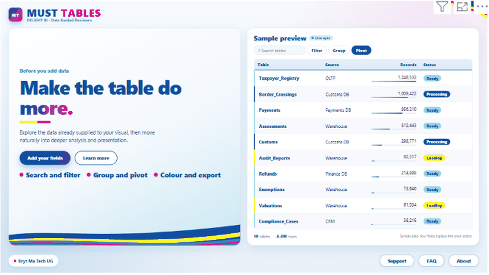

# MUST Tables



**A Power BI custom visual for analytical tables.** Search, filter, sort, group, pivot, calculate, format and export - inside your report.

Built by **Delight BI** - *Data Guided Decisions* - a Bryt Ma Tech UG business.

## What it does

- **Explore:** search, column filters, sorting, hide and reorder columns, grouping with drill-down.
- **Analyse:** pivot mode, calculations, combined columns.
- **Present:** exact font and row-height controls that follow the size of the Power BI tile, saved views, and layouts for small screens.
- **Format:** conditional formatting, data bars and saved colour themes.
- **Share:** CSV, Excel, JSON and PDF export where the report and the Power BI host allow it.

Add fields to **Rows** and **Values** and the landing page above turns into your table.

## Get the visual

| I want... | Go to |
|---|---|
| The newest build | **Actions** tab > newest green run > **Artifacts** > `must-tables-pbiviz` (kept 30 days) |
| A permanent, shareable file | **Releases** (one is created for every version tag such as `v1.0.0.50`) |

Import it in Power BI Desktop: **Visualizations** > **...** > **Import a visual from a file**.

## Build it yourself

You need Node.js 20 and Git.

```
git clone https://github.com/muhumuza684/must-tables-.git
cd must-tables-
npm ci
npm run ci          # type-check, tests, lint and package - the same gate GitHub runs
```

The visual is written to `dist/*.pbiviz`.

**Start here for everything else:** [docs/BUILDING.md](docs/BUILDING.md) explains how the visual is put together, how data flows through it, how the styling is organised, how to change text, brand and settings, how to release, and how to fix the common problems.

## Tech

TypeScript, LESS, Power BI Visuals API 5.3, D3, ExcelJS, jsPDF, Jest and ESLint. Built and checked automatically with GitHub Actions.

## Licence

Copyright (c) Bryt Ma Tech UG. All rights reserved.
